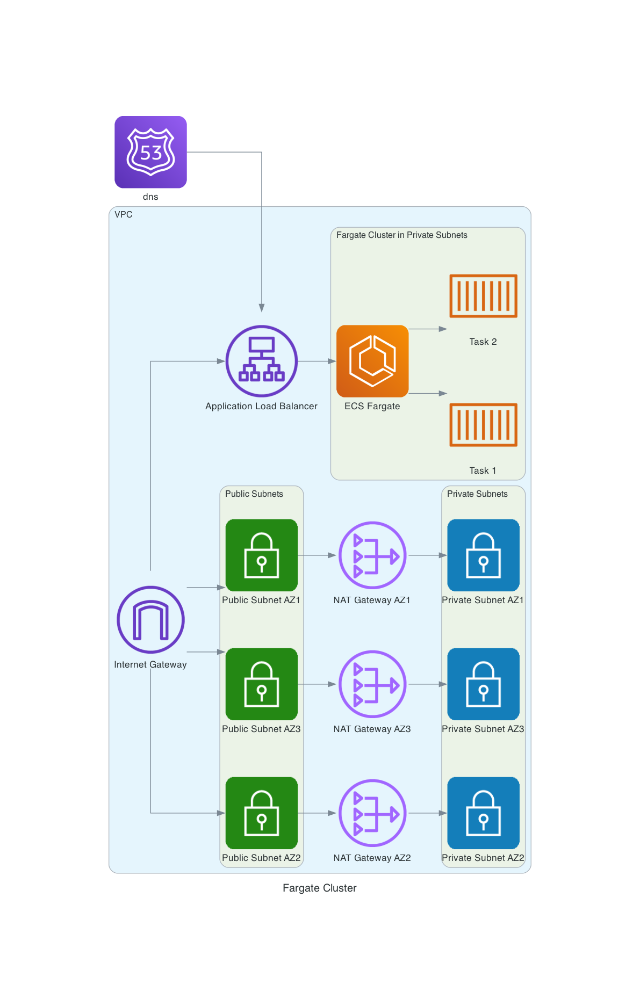

## Requirements
- AWS Account
- IAM user / role with permissions to execute Terraform.


How to execute:

1. Configure AWS credentials
2. Create Terraform Bucket in AWS 
3. Create DynamoDB table for Terraform state lock

Those can be created also using Terraform using a local state, and once its created, migrated to the remote state.

Once you have created the Terraform Bucket and the DynamoDB table, please,  [modify the backend configuration](backend.tf#L7-L11)  in the Terraform configuration files to use the Terraform Bucket and DynamoDB table for storing the Terraform state and locking it.

### Execute Terraform
1. Initialize Terraform: 
```
terraform init
```
2. Apply Terraform plan:
```
terraform plan 
```
3. Apply Terraform
```
terraform apply
```

## Diagram
The provided diagram illustrates the Fargate cluster architecture, which includes the following components:
- Virtual Private Cloud (VPC): 3 privates and 3 public subnets with an internet gateway to allow internet access and a nat gateway to provide outbound internet access for resources in the private subnets.
- Application Load Balancer (ALB)
- ECS Cluster
- ECS Service
- ECS Task Definition

The ALB is under the public subnets while the Fargate containers are under the private subnets. This allows the application to be accessible from the internet while keeping the containers secure within the private network.

We are pulling directly from the Dock Hub repository using the image URI, but we could also use a private ECR repository to store our Docker images for more control and security.



## Improvements.

- Create and generate a SSL certificate to have secured connection between the client and the application. This SSL certificate can be generated using AWS Certificate Manager and add it to the ALB listener. I could not create because it requires having a custom domain name.
- Add autoscaling policies to the ECS service to automatically scale the number of tasks based on CPU and memory utilization.
- Implement secure access to the application by integrating Amazon Cognito for user authentication and authorization creating a Amazon Corn ito User Pool and Amazon Cognito Identity Pool. Then, on the ALB, configure the listener to use the Amazon Cognito to authenticate users before accessing the application.
- Add CloudWatch logging and monitoring to the ECS task and service to gain visibility into the application's performance and health.
- Implement CI/CD pipelines to automate the deployment of the application, reducing manual effort and ensuring consistent and reliable deployments.
- Add Environments (e.g., dev, staging, prod) to the Terraform configuration to manage different deployment stages and their respective configurations.


## Providers

| Name | Version |
|------|---------|
| <a name="provider_aws"></a> [aws](#provider\_aws) | 5.83.1 |

## Modules

| Name | Source | Version |
|------|--------|---------|
| <a name="module_ecs"></a> [ecs](#module\_ecs) | terraform-aws-modules/ecs/aws | n/a |
| <a name="module_vpc"></a> [vpc](#module\_vpc) | terraform-aws-modules/vpc/aws | n/a |

## Resources

| Name | Type |
|------|------|
| [aws_ecs_service.nginx-hello](https://registry.terraform.io/providers/hashicorp/aws/latest/docs/resources/ecs_service) | resource |
| [aws_ecs_task_definition.nginx](https://registry.terraform.io/providers/hashicorp/aws/latest/docs/resources/ecs_task_definition) | resource |
| [aws_lb.scale](https://registry.terraform.io/providers/hashicorp/aws/latest/docs/resources/lb) | resource |
| [aws_lb_listener.scale](https://registry.terraform.io/providers/hashicorp/aws/latest/docs/resources/lb_listener) | resource |
| [aws_lb_target_group.scale](https://registry.terraform.io/providers/hashicorp/aws/latest/docs/resources/lb_target_group) | resource |
| [aws_security_group.sg_alb](https://registry.terraform.io/providers/hashicorp/aws/latest/docs/resources/security_group) | resource |
| [aws_security_group.sg_task](https://registry.terraform.io/providers/hashicorp/aws/latest/docs/resources/security_group) | resource |
| [aws_security_group_rule.sg_task_80](https://registry.terraform.io/providers/hashicorp/aws/latest/docs/resources/security_group_rule) | resource |
| [aws_vpc_security_group_egress_rule.allow_all_task_traffic_ipv4](https://registry.terraform.io/providers/hashicorp/aws/latest/docs/resources/vpc_security_group_egress_rule) | resource |
| [aws_vpc_security_group_egress_rule.allow_all_traffic_ipv4](https://registry.terraform.io/providers/hashicorp/aws/latest/docs/resources/vpc_security_group_egress_rule) | resource |
| [aws_vpc_security_group_ingress_rule.sg_alb_443](https://registry.terraform.io/providers/hashicorp/aws/latest/docs/resources/vpc_security_group_ingress_rule) | resource |

## Inputs

| Name | Description | Type | Default | Required |
|------|-------------|------|---------|:--------:|
| <a name="input_cidr"></a> [cidr](#input\_cidr) | n/a | `string` | `"10.0.0.0/16"` | no |
| <a name="input_default_tags"></a> [default\_tags](#input\_default\_tags) | Default tags | `map(string)` | <pre>{<br/>  "Name": "your-name",<br/>  "app": "nginx",<br/>  "cost-center": "cost",<br/>  "environment": "environment"<br/>}</pre> | no |
| <a name="input_project_name"></a> [project\_name](#input\_project\_name) | n/a | `string` | `"nginx"` | no |
| <a name="input_scale_alb_enable_deletion_protection"></a> [scale\_alb\_enable\_deletion\_protection](#input\_scale\_alb\_enable\_deletion\_protection) | Prevent ALB from deletion | `bool` | `false` | no |
| <a name="input_scale_alb_internal"></a> [scale\_alb\_internal](#input\_scale\_alb\_internal) | Specify if the ALB is internet facing or not | `bool` | `false` | no |
| <a name="input_scale_alb_timeout"></a> [scale\_alb\_timeout](#input\_scale\_alb\_timeout) | Specify the ALB timeout | `string` | `"60"` | no |
| <a name="input_scale_health_check_healthy_threshold"></a> [scale\_health\_check\_healthy\_threshold](#input\_scale\_health\_check\_healthy\_threshold) | Protocol to use to connect with the target. Defaults to HTTP | `number` | `3` | no |
| <a name="input_scale_health_check_interval"></a> [scale\_health\_check\_interval](#input\_scale\_health\_check\_interval) | Protocol to use to connect with the target. Defaults to HTTP | `number` | `30` | no |
| <a name="input_scale_health_check_path"></a> [scale\_health\_check\_path](#input\_scale\_health\_check\_path) | Protocol to use to connect with the target. Defaults to HTTP | `string` | `"/"` | no |
| <a name="input_scale_health_check_port"></a> [scale\_health\_check\_port](#input\_scale\_health\_check\_port) | Port to use to connect with the target. Valid values are either ports 1-65535 | `number` | `80` | no |
| <a name="input_scale_health_check_protocol"></a> [scale\_health\_check\_protocol](#input\_scale\_health\_check\_protocol) | Protocol to use to connect with the target. Defaults to HTTP | `string` | `"HTTP"` | no |
| <a name="input_scale_health_check_unhealthy_threshold"></a> [scale\_health\_check\_unhealthy\_threshold](#input\_scale\_health\_check\_unhealthy\_threshold) | Protocol to use to connect with the target. Defaults to HTTP | `number` | `3` | no |
| <a name="input_scale_tg_port"></a> [scale\_tg\_port](#input\_scale\_tg\_port) | Target Group Port | `number` | `80` | no |
| <a name="input_scale_tg_protocol"></a> [scale\_tg\_protocol](#input\_scale\_tg\_protocol) | Target Group Port | `string` | `"HTTP"` | no |

## Outputs

| Name | Description |
|------|-------------|
| <a name="output_dns_alb"></a> [dns\_alb](#output\_dns\_alb) | DNS value for the ALB |


